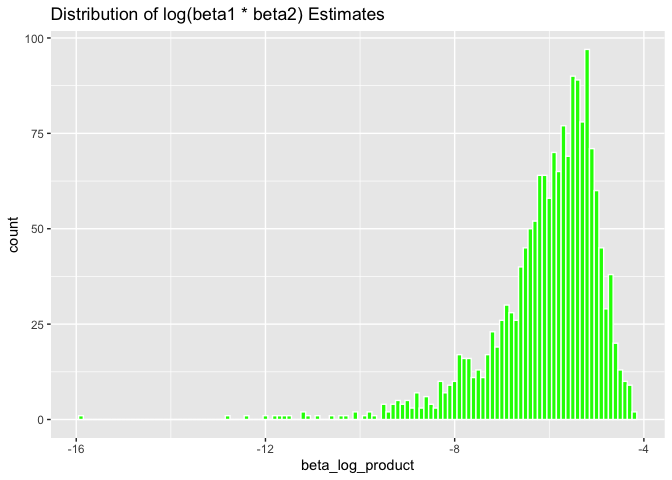

HW6
================
Tongxi Yu
2023-12-03

``` r
library(tidyverse)
```

    ## ── Attaching core tidyverse packages ──────────────────────── tidyverse 2.0.0 ──
    ## ✔ dplyr     1.1.3     ✔ readr     2.1.4
    ## ✔ forcats   1.0.0     ✔ stringr   1.5.0
    ## ✔ ggplot2   3.4.3     ✔ tibble    3.2.1
    ## ✔ lubridate 1.9.2     ✔ tidyr     1.3.0
    ## ✔ purrr     1.0.2     
    ## ── Conflicts ────────────────────────────────────────── tidyverse_conflicts() ──
    ## ✖ dplyr::filter() masks stats::filter()
    ## ✖ dplyr::lag()    masks stats::lag()
    ## ℹ Use the conflicted package (<http://conflicted.r-lib.org/>) to force all conflicts to become errors

# Problem 2

``` r
weather_df = 
  rnoaa::meteo_pull_monitors(
    c("USW00094728"),
    var = c("PRCP", "TMIN", "TMAX"), 
    date_min = "2022-01-01",
    date_max = "2022-12-31") |>
  mutate(
    name = recode(id, USW00094728 = "CentralPark_NY"),
    tmin = tmin / 10,
    tmax = tmax / 10) |>
  select(name, id, everything())
```

    ## using cached file: /Users/yutongxi/Library/Caches/org.R-project.R/R/rnoaa/noaa_ghcnd/USW00094728.dly

    ## date created (size, mb): 2023-10-03 10:25:05.941316 (8.525)

    ## file min/max dates: 1869-01-01 / 2023-09-30

``` r
lm(tmax ~ tmin + prcp, data = weather_df) |> 
  broom::tidy() |> 
  knitr::kable(digits = 3)
```

| term        | estimate | std.error | statistic | p.value |
|:------------|---------:|----------:|----------:|--------:|
| (Intercept) |    8.043 |     0.230 |    34.959 |   0.000 |
| tmin        |    1.013 |     0.016 |    62.734 |   0.000 |
| prcp        |   -0.002 |     0.002 |    -0.733 |   0.464 |

``` r
boot_sample = function(df) {
  sample_frac(df, replace = TRUE)
}
```

``` r
boot_straps = 
  tibble(strap_number = 1:5000) |> 
  mutate(
    strap_sample = map(strap_number, \(i) boot_sample(df = weather_df))
  )

boot_straps
```

    ## # A tibble: 5,000 × 2
    ##    strap_number strap_sample      
    ##           <int> <list>            
    ##  1            1 <tibble [365 × 6]>
    ##  2            2 <tibble [365 × 6]>
    ##  3            3 <tibble [365 × 6]>
    ##  4            4 <tibble [365 × 6]>
    ##  5            5 <tibble [365 × 6]>
    ##  6            6 <tibble [365 × 6]>
    ##  7            7 <tibble [365 × 6]>
    ##  8            8 <tibble [365 × 6]>
    ##  9            9 <tibble [365 × 6]>
    ## 10           10 <tibble [365 × 6]>
    ## # ℹ 4,990 more rows

``` r
fit_lm = function(data) {
  lm(tmax ~ tmin + prcp, data = data)
}
```

Fit a linear regression model for each bootstrap sample

``` r
bootstrap_results =
  boot_straps %>%
  mutate(
    lm_fit = map(strap_sample, fit_lm),
    r_squared = map_dbl(lm_fit, ~ broom::glance(.)$r.squared),
    beta_log_product = map_dbl(lm_fit, ~ log(coef(.)["tmin"] * coef(.)["prcp"]))
  )
```

    ## Warning: There were 3398 warnings in `mutate()`.
    ## The first warning was:
    ## ℹ In argument: `beta_log_product = map_dbl(lm_fit, ~log(coef(.)["tmin"] *
    ##   coef(.)["prcp"]))`.
    ## Caused by warning in `log()`:
    ## ! NaNs produced
    ## ℹ Run `dplyr::last_dplyr_warnings()` to see the 3397 remaining warnings.

``` r
ggplot(bootstrap_results, aes(x = r_squared)) +
  geom_histogram(binwidth = 0.01, fill = "blue", color = "white") +
  labs(title = "Distribution of r^2 Estimates")
```

<!-- --> The r^2
estimations are close to normal distribution.

``` r
ggplot(bootstrap_results, aes(x = beta_log_product)) +
  geom_histogram(binwidth = 0.1, fill = "green", color = "white") +
  labs(title = "Distribution of log(beta1 * beta2) Estimates")
```

    ## Warning: Removed 3398 rows containing non-finite values (`stat_bin()`).

<!-- --> log(beta1 \*
beta2) estimations are left-skewed

``` r
conf_interval_r_squared = quantile(bootstrap_results$r_squared, c(0.025, 0.975))

conf_interval_beta_log_product = quantile(bootstrap_results$beta_log_product, c(0.025, 0.975), na.rm = TRUE)
```

``` r
conf_interval_r_squared
```

    ##      2.5%     97.5% 
    ## 0.8895426 0.9403267

``` r
conf_interval_beta_log_product
```

    ##      2.5%     97.5% 
    ## -8.893421 -4.590991

Problem 3
