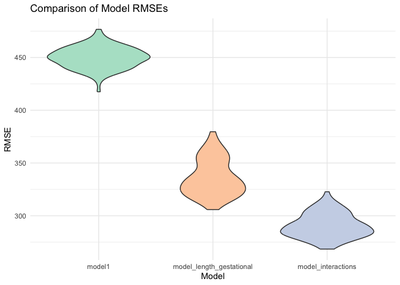

HW6
================
Tongxi Yu
2023-12-03

``` r
library(tidyverse)
```

    ## ── Attaching core tidyverse packages ──────────────────────── tidyverse 2.0.0 ──
    ## ✔ dplyr     1.1.3     ✔ readr     2.1.4
    ## ✔ forcats   1.0.0     ✔ stringr   1.5.0
    ## ✔ ggplot2   3.4.3     ✔ tibble    3.2.1
    ## ✔ lubridate 1.9.2     ✔ tidyr     1.3.0
    ## ✔ purrr     1.0.2     
    ## ── Conflicts ────────────────────────────────────────── tidyverse_conflicts() ──
    ## ✖ dplyr::filter() masks stats::filter()
    ## ✖ dplyr::lag()    masks stats::lag()
    ## ℹ Use the conflicted package (<http://conflicted.r-lib.org/>) to force all conflicts to become errors

``` r
library(purrr)
library(ggridges)
library(modelr)
```

# Problem 2

``` r
weather_df = 
  rnoaa::meteo_pull_monitors(
    c("USW00094728"),
    var = c("PRCP", "TMIN", "TMAX"), 
    date_min = "2022-01-01",
    date_max = "2022-12-31") |>
  mutate(
    name = recode(id, USW00094728 = "CentralPark_NY"),
    tmin = tmin / 10,
    tmax = tmax / 10) |>
  select(name, id, everything())
```

    ## using cached file: /Users/yutongxi/Library/Caches/org.R-project.R/R/rnoaa/noaa_ghcnd/USW00094728.dly

    ## date created (size, mb): 2023-10-03 10:25:05.941316 (8.525)

    ## file min/max dates: 1869-01-01 / 2023-09-30

``` r
lm(tmax ~ tmin + prcp, data = weather_df) |> 
  broom::tidy() |> 
  knitr::kable(digits = 3)
```

| term        | estimate | std.error | statistic | p.value |
|:------------|---------:|----------:|----------:|--------:|
| (Intercept) |    8.043 |     0.230 |    34.959 |   0.000 |
| tmin        |    1.013 |     0.016 |    62.734 |   0.000 |
| prcp        |   -0.002 |     0.002 |    -0.733 |   0.464 |

``` r
boot_sample = function(df) {
  sample_frac(df, replace = TRUE)
}
```

``` r
boot_straps = 
  tibble(strap_number = 1:5000) |> 
  mutate(
    strap_sample = map(strap_number, \(i) boot_sample(df = weather_df))
  )

boot_straps
```

    ## # A tibble: 5,000 × 2
    ##    strap_number strap_sample      
    ##           <int> <list>            
    ##  1            1 <tibble [365 × 6]>
    ##  2            2 <tibble [365 × 6]>
    ##  3            3 <tibble [365 × 6]>
    ##  4            4 <tibble [365 × 6]>
    ##  5            5 <tibble [365 × 6]>
    ##  6            6 <tibble [365 × 6]>
    ##  7            7 <tibble [365 × 6]>
    ##  8            8 <tibble [365 × 6]>
    ##  9            9 <tibble [365 × 6]>
    ## 10           10 <tibble [365 × 6]>
    ## # ℹ 4,990 more rows

``` r
fit_lm = function(data) {
  lm(tmax ~ tmin + prcp, data = data)
}
```

Fit a linear regression model for each bootstrap sample

``` r
bootstrap_results =
  boot_straps %>%
  mutate(
    lm_fit = map(strap_sample, fit_lm),
    r_squared = map_dbl(lm_fit, ~ broom::glance(.)$r.squared),
    beta_log_product = map_dbl(lm_fit, ~ log(coef(.)["tmin"] * coef(.)["prcp"]))
  )
```

    ## Warning: There were 3335 warnings in `mutate()`.
    ## The first warning was:
    ## ℹ In argument: `beta_log_product = map_dbl(lm_fit, ~log(coef(.)["tmin"] *
    ##   coef(.)["prcp"]))`.
    ## Caused by warning in `log()`:
    ## ! NaNs produced
    ## ℹ Run `dplyr::last_dplyr_warnings()` to see the 3334 remaining warnings.

``` r
ggplot(bootstrap_results, aes(x = r_squared)) +
  geom_histogram(binwidth = 0.01, fill = "blue", color = "white") +
  labs(title = "Distribution of r^2 Estimates")
```

<!-- --> The r^2
estimations are close to normal distribution.

``` r
ggplot(bootstrap_results, aes(x = beta_log_product)) +
  geom_histogram(binwidth = 0.1, fill = "green", color = "white") +
  labs(title = "Distribution of log(beta1 * beta2) Estimates")
```

    ## Warning: Removed 3335 rows containing non-finite values (`stat_bin()`).

<!-- --> log(beta1 \*
beta2) estimations are left-skewed

``` r
conf_interval_r_squared = quantile(bootstrap_results$r_squared, c(0.025, 0.975))

conf_interval_beta_log_product = quantile(bootstrap_results$beta_log_product, c(0.025, 0.975), na.rm = TRUE)
```

``` r
conf_interval_r_squared
```

    ##      2.5%     97.5% 
    ## 0.8881933 0.9407424

``` r
conf_interval_beta_log_product
```

    ##      2.5%     97.5% 
    ## -9.032400 -4.586329

Problem 3

``` r
bw_df <- read_csv("Data/birthweight.csv")
```

    ## Rows: 4342 Columns: 20
    ## ── Column specification ────────────────────────────────────────────────────────
    ## Delimiter: ","
    ## dbl (20): babysex, bhead, blength, bwt, delwt, fincome, frace, gaweeks, malf...
    ## 
    ## ℹ Use `spec()` to retrieve the full column specification for this data.
    ## ℹ Specify the column types or set `show_col_types = FALSE` to quiet this message.

``` r
summary(bw_df)
```

    ##     babysex          bhead          blength           bwt           delwt      
    ##  Min.   :1.000   Min.   :21.00   Min.   :20.00   Min.   : 595   Min.   : 86.0  
    ##  1st Qu.:1.000   1st Qu.:33.00   1st Qu.:48.00   1st Qu.:2807   1st Qu.:131.0  
    ##  Median :1.000   Median :34.00   Median :50.00   Median :3132   Median :143.0  
    ##  Mean   :1.486   Mean   :33.65   Mean   :49.75   Mean   :3114   Mean   :145.6  
    ##  3rd Qu.:2.000   3rd Qu.:35.00   3rd Qu.:51.00   3rd Qu.:3459   3rd Qu.:157.0  
    ##  Max.   :2.000   Max.   :41.00   Max.   :63.00   Max.   :4791   Max.   :334.0  
    ##     fincome          frace          gaweeks         malform        
    ##  Min.   : 0.00   Min.   :1.000   Min.   :17.70   Min.   :0.000000  
    ##  1st Qu.:25.00   1st Qu.:1.000   1st Qu.:38.30   1st Qu.:0.000000  
    ##  Median :35.00   Median :2.000   Median :39.90   Median :0.000000  
    ##  Mean   :44.11   Mean   :1.655   Mean   :39.43   Mean   :0.003455  
    ##  3rd Qu.:65.00   3rd Qu.:2.000   3rd Qu.:41.10   3rd Qu.:0.000000  
    ##  Max.   :96.00   Max.   :8.000   Max.   :51.30   Max.   :1.000000  
    ##     menarche        mheight          momage         mrace      
    ##  Min.   : 0.00   Min.   :48.00   Min.   :12.0   Min.   :1.000  
    ##  1st Qu.:12.00   1st Qu.:62.00   1st Qu.:18.0   1st Qu.:1.000  
    ##  Median :12.00   Median :63.00   Median :20.0   Median :2.000  
    ##  Mean   :12.51   Mean   :63.49   Mean   :20.3   Mean   :1.627  
    ##  3rd Qu.:13.00   3rd Qu.:65.00   3rd Qu.:22.0   3rd Qu.:2.000  
    ##  Max.   :19.00   Max.   :77.00   Max.   :44.0   Max.   :4.000  
    ##      parity            pnumlbw     pnumsga      ppbmi            ppwt      
    ##  Min.   :0.000000   Min.   :0   Min.   :0   Min.   :13.07   Min.   : 70.0  
    ##  1st Qu.:0.000000   1st Qu.:0   1st Qu.:0   1st Qu.:19.53   1st Qu.:110.0  
    ##  Median :0.000000   Median :0   Median :0   Median :21.03   Median :120.0  
    ##  Mean   :0.002303   Mean   :0   Mean   :0   Mean   :21.57   Mean   :123.5  
    ##  3rd Qu.:0.000000   3rd Qu.:0   3rd Qu.:0   3rd Qu.:22.91   3rd Qu.:134.0  
    ##  Max.   :6.000000   Max.   :0   Max.   :0   Max.   :46.10   Max.   :287.0  
    ##      smoken           wtgain      
    ##  Min.   : 0.000   Min.   :-46.00  
    ##  1st Qu.: 0.000   1st Qu.: 15.00  
    ##  Median : 0.000   Median : 22.00  
    ##  Mean   : 4.145   Mean   : 22.08  
    ##  3rd Qu.: 5.000   3rd Qu.: 28.00  
    ##  Max.   :60.000   Max.   : 89.00

``` r
missing_values <- colSums(is.na(bw_df))
print(missing_values)
```

    ##  babysex    bhead  blength      bwt    delwt  fincome    frace  gaweeks 
    ##        0        0        0        0        0        0        0        0 
    ##  malform menarche  mheight   momage    mrace   parity  pnumlbw  pnumsga 
    ##        0        0        0        0        0        0        0        0 
    ##    ppbmi     ppwt   smoken   wtgain 
    ##        0        0        0        0

``` r
bw_df <- bw_df |>
  janitor::clean_names()|>
  mutate(
    babysex = as.factor(babysex),
    frace = as.factor(frace),
    malform = as.factor(malform),
    mrace = as.factor(mrace)
  )
```

This dataset contains 4342 observations of 20 variables with no missing
values. I’m trying to investigate the impact of several key factors on
the weight of a newborn, as measured in grams (bwt). I chose to start
with some factors might affect birthweight, including gestational age,
mother’s age, weight gain, and smoking during pregnancy.

``` r
model1 <- lm(bwt ~ gaweeks + momage + wtgain + smoken, data = bw_df)
summary(model1)
```

    ## 
    ## Call:
    ## lm(formula = bwt ~ gaweeks + momage + wtgain + smoken, data = bw_df)
    ## 
    ## Residuals:
    ##      Min       1Q   Median       3Q      Max 
    ## -1800.39  -283.85     2.99   289.84  1516.67 
    ## 
    ## Coefficients:
    ##             Estimate Std. Error t value Pr(>|t|)    
    ## (Intercept) 231.1248    89.6821   2.577  0.00999 ** 
    ## gaweeks      60.3773     2.2091  27.332  < 2e-16 ***
    ## momage       15.7720     1.7887   8.818  < 2e-16 ***
    ## wtgain        9.6180     0.6352  15.142  < 2e-16 ***
    ## smoken       -7.1676     0.9258  -7.742 1.21e-14 ***
    ## ---
    ## Signif. codes:  0 '***' 0.001 '**' 0.01 '*' 0.05 '.' 0.1 ' ' 1
    ## 
    ## Residual standard error: 450.2 on 4337 degrees of freedom
    ## Multiple R-squared:  0.2282, Adjusted R-squared:  0.2274 
    ## F-statistic: 320.5 on 4 and 4337 DF,  p-value: < 2.2e-16

``` r
library(ggplot2)
library(modelr)
library(dplyr)

bw_df <- bw_df |>
  modelr::add_predictions(model1,var = "pred") |>
  modelr::add_residuals(model1,var = "resid")

ggplot(bw_df, aes(x = pred, y = resid)) +
  geom_point() +
  geom_hline(yintercept = 0, linetype = "dashed", color = "red") +
  labs(title = "Residuals vs Fitted Values", x = "Fitted Values", y = "Residuals")
```

<!-- --> In summary, the
model indicates that gestational age, mother’s age, weight gain, and
smoking during pregnancy are significant predictors of birth weight, and
the overall model is statistically significant. The model explains about
22.82% of the variability in birth weight.

``` r
model_length_gestational <- lm(bwt ~ blength + gaweeks, data = bw_df) 
```

``` r
model_interactions <- lm(bwt ~ bhead + blength + babysex + bhead * blength + bhead * babysex + blength * babysex + bhead * blength * babysex, data = bw_df)
summary(model_interactions)
```

    ## 
    ## Call:
    ## lm(formula = bwt ~ bhead + blength + babysex + bhead * blength + 
    ##     bhead * babysex + blength * babysex + bhead * blength * babysex, 
    ##     data = bw_df)
    ## 
    ## Residuals:
    ##      Min       1Q   Median       3Q      Max 
    ## -1132.99  -190.42   -10.33   178.63  2617.96 
    ## 
    ## Coefficients:
    ##                          Estimate Std. Error t value Pr(>|t|)    
    ## (Intercept)            -7176.8170  1264.8397  -5.674 1.49e-08 ***
    ## bhead                    181.7956    38.0542   4.777 1.84e-06 ***
    ## blength                  102.1269    26.2118   3.896 9.92e-05 ***
    ## babysex2                6374.8684  1677.7669   3.800 0.000147 ***
    ## bhead:blength             -0.5536     0.7802  -0.710 0.478012    
    ## bhead:babysex2          -198.3932    51.0917  -3.883 0.000105 ***
    ## blength:babysex2        -123.7729    35.1185  -3.524 0.000429 ***
    ## bhead:blength:babysex2     3.8781     1.0566   3.670 0.000245 ***
    ## ---
    ## Signif. codes:  0 '***' 0.001 '**' 0.01 '*' 0.05 '.' 0.1 ' ' 1
    ## 
    ## Residual standard error: 287.7 on 4334 degrees of freedom
    ## Multiple R-squared:  0.6849, Adjusted R-squared:  0.6844 
    ## F-statistic:  1346 on 7 and 4334 DF,  p-value: < 2.2e-16

``` r
cv_df=
  crossv_mc(bw_df,100)|>
   mutate(
    train = map(train, as_tibble),
    test = map(test, as_tibble))

cv_df=
  cv_df|>
  mutate(
    model1 = map(train,~lm(bwt ~ gaweeks + momage + wtgain + smoken, data = .x)),
    model_length_gestational  = map(train, ~lm(bwt ~ gaweeks + blength, data = .x)),
    model_interactions  = map(train, ~lm(bwt ~ bhead + blength + babysex + bhead * blength + bhead * babysex + blength * babysex + bhead * blength * babysex, data = .x)))|>
  mutate(
    rmse_model1 = map2_dbl(model1, test, ~rmse(model = .x,data = .y)),
    rmse_model_length_gestational = map2_dbl(model_length_gestational, test, ~rmse(model = .x,data = .y)),
    rmse_model_interactions = map2_dbl(model_interactions, test, ~rmse(model = .x,data = .y)))
```

``` r
cv_df |> 
  select(starts_with("rmse")) |> 
  pivot_longer(
    everything(),
    names_to = "model", 
    values_to = "rmse",
    names_prefix = "rmse_") |> 
  mutate(model = fct_inorder(model)) |> 
  ggplot(aes(x = model, y = rmse,fill = model)) + 
  geom_violin()+
  scale_fill_brewer(palette = "Pastel2") +
  labs(x = "Model", y = "RMSE", title = "Comparison of Model RMSEs") +
  theme_minimal()+
  theme(legend.position = "none")
```

<!-- --> The model using
head circumference, length, sex, and all interactions (including the
three-way interaction) between these has the lowest RMSE which indicates
best model performance
